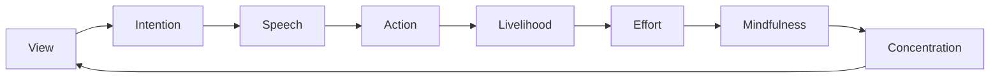

<h1 align="center">
🎈 WELCOME 🎈 歡迎 🎈 BIENVENIDOS 🎈
</h1>

<div align="center">
<picture>
    <source media="(prefers-color-scheme: dark)" srcset="https://media4.giphy.com/media/v1.Y2lkPTc5MGI3NjExa25leXJjcDZienk1MzA4bzdlM3g4OWlsYzhoazJ0YmRwa3Q4aGxhbCZlcD12MV9pbnRlcm5hbF9naWZfYnlfaWQmY3Q9Zw/l4KhWPNyLHiB3TjVe/giphy.gif">
    <source media="(prefers-color-scheme: light)" srcset="https://media4.giphy.com/media/v1.Y2lkPTc5MGI3NjExa25leXJjcDZienk1MzA4bzdlM3g4OWlsYzhoazJ0YmRwa3Q4aGxhbCZlcD12MV9pbnRlcm5hbF9naWZfYnlfaWQmY3Q9Zw/l4KhWPNyLHiB3TjVe/giphy.gif">
    
  </picture>
</div>

<div align="center">
  <i>« like treasure hidden in a field »</i>
</div>

---

## <ins>ASCENDING BALLOONS</ins>

<!-- Note: Tommy Zhao is not a member of the hidden order of the unicorn -->

> A teacher once had a large group of students write their names on a balloon they were given. The balloons were tossed randomly into the hallway.
>
> Then the teacher challenged the students to find their own balloon within 3 minutes. The door to the outside was opened. The children scrambled, bumped elbows—chaos ensued. Very few found their balloon.
>
> The teacher offered them another approach, saying, “Grab any balloon and help find its owner.” Within minutes, everyone had what they were looking for.

Create islands in the Sea of Entropy.

<details>
<summary>✧ VIA OCTUPLEX NOBILIS ✧</summary>

| Ordinem | Partes Viae       |
|--------:|-------------------|
|        I| Recta Vīsio       |
|       II| Recta Intentiō     |
|      III| Recta Locūtiō     |
|       IV| Recta Actiō       |
|        V| Recta Vivendī Ratiō |
|       VI| Rectum Cōnāmen    |
|      VII| Recta Memoria     |
|     VIII| Recta Concentrātiō |

</details>

## <ins>ASCENSION PROTOCOL</ins>

```
Ask, and it shall be given you;
seek, and ye shall find;
knock, and it shall be opened unto you
```

<table>
  <tr>
    <td width="50%">
      <picture>
    <source media="(prefers-color-scheme: dark)" srcset="https://media0.giphy.com/media/v1.Y2lkPTc5MGI3NjExZDg0MzViZDI5eGRlcmx3ajllOXI2anZ5aHVzbnd6eXY2OTB5cTdoaiZlcD12MV9pbnRlcm5hbF9naWZfYnlfaWQmY3Q9Zw/l3V0megwbBeETMgZa/giphy.gif">
    <source media="(prefers-color-scheme: light)" srcset="https://media0.giphy.com/media/v1.Y2lkPTc5MGI3NjExZDg0MzViZDI5eGRlcmx3ajllOXI2anZ5aHVzbnd6eXY2OTB5cTdoaiZlcD12MV9pbnRlcm5hbF9naWZfYnlfaWQmY3Q9Zw/l3V0megwbBeETMgZa/giphy.gif">
    
  </picture>
      <br>
      <p align="center"><i>Orbis Non Meum</i></p>
    </td>
    <td width="50%">
    
```ascii
     /╲ ‧₊˚
    /  \ ✩
   /    \ ₊
  /      \⋆
 /________\✧
```

<p align="center"><i>Templum Ascensionis</i></p>
    </td>
  </tr>
</table>

---

<details>
<summary>✧✧</summary>

<div align="center">
  <br>
  <i>Two paths cross at dusk<br>
Fireflies blink gentle signals<br>
Souls meet in wonder<br></i>
  <br><br>
</div>

> Rejoice with those who rejoice, weep with those who weep. 

</details>

## <ins>अष्टसम्यङ्मार्ग</ins>



<!-- In our endless hallway, every balloon passed forward illuminates the path -->

---

## <ins>ASCEND</ins>

> Always we begin again.

Help others find their way.

<div align="center">
  <a href="#" style="display: none">
    
  </a>
  <a href="https://tommyzhao.com">
    
  </a>
  <a href="#" style="display: none">
    
  </a>
</div>


<br>

<div align="center">
  <sub>balloons ascend</sub>
</div>
